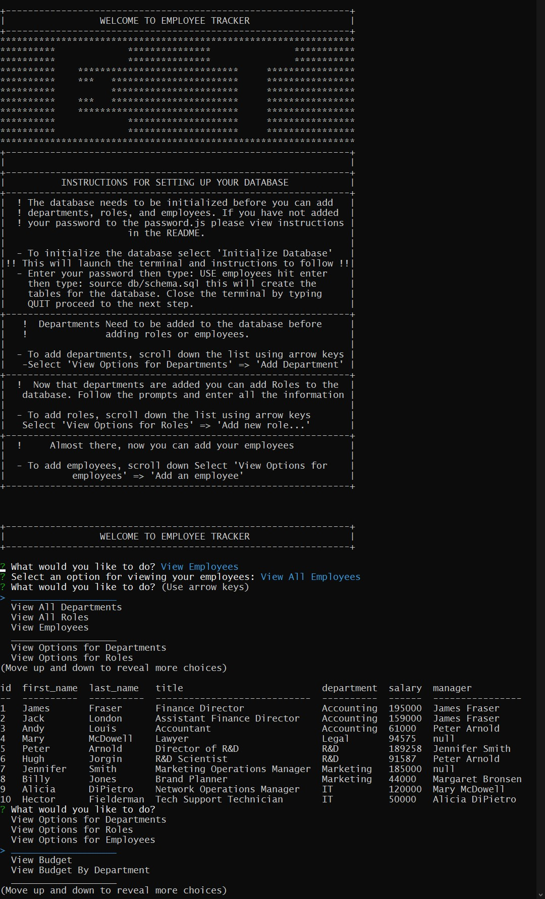

# Employee Tracker  
[](https://opensource.org/licenses/MIT)  

# Screenshot


# Description
Employee Tracker is a simple CLI for managing your MySQL Employee's database.

# Table of Contents
- [Demo](#demo)  
- [Technology](#technology)  
- [Features](#features)  
- [Installation](#installation)  
- [Usage](#usage)  
- [Contribute](#contribute)  
- [Tests](#tests)  
- [Questions](#questions)  
- [License](#license)

# Demo
[DEMO: Employee Tracker]( https://drive.google.com/file/d/1_rLpuJNYqfKFYjpfh1-PHcIBcDm9GDr8/view)

# Technology 
| Technology | Description                        |Links ↘️ |
| ---------- | -----------------------------------| ------|  
|  | JavaScript | []() |

# Features
This application features Node.js, Inquirer for prompting the user, mysql2 for SQL query, and the console.table package for a cleaner look over the regular ```console.table()``` module. 

# Installation  
Project Repository: [Employee Tracker](https://github.com/iiTONELOC/employee-tracker)  
Clone the repo, the link is above. Navigate to the root of the directory and run ```npm install``` once the modules have loaded open the files in your IDE by invoking ```code .```, navigate to the password.js file and insert the password for your MySQL server and close the IDE. The program can then be invoked by running ```node index``` from the root of the application. 

# Usage
[Employee Tracker](https://github.com/iiTONELOC/employee-tracker)  
This program is designed for managing your employees. If this is a first use please make sure you follow the installation instructions. Run the program by ```node index```, scroll down to ```Initialize Database```, confirm twice, and follow the provided instructions. You must add Departments => Roles => then Employees. A test seeds file has been included if you want to get familiar with the application first. Navigate to ```Launch MySQL CLI```, enter the password for your server, type: ``` USE employees ``` then you can run the following command to load information into the database: ``` SOURCE db/seeds.sql ``` hit enter then type: ``` QUIT ```.

# Contribute 
 

# Tests
If you wish to test the app follow the instructions for seeding under USAGE.

# Questions
Feel free to reach out if you have any questions

Contact via GitHub: [iiTONELOC](https://github.com/iiTONELOC)  


# License
MIT License

        Copyright (c) 2021 Anthony Tropeano
        
        Permission is hereby granted, free of charge, to any person obtaining a copy
        of this software and associated documentation files (the "Software"), to deal
        in the Software without restriction, including without limitation the rights
        to use, copy, modify, merge, publish, distribute, sublicense, and/or sell
        copies of the Software, and to permit persons to whom the Software is
        furnished to do so, subject to the following conditions:
        
        The above copyright notice and this permission notice shall be included in all
        copies or substantial portions of the Software.
        
        THE SOFTWARE IS PROVIDED "AS IS", WITHOUT WARRANTY OF ANY KIND, EXPRESS OR
        IMPLIED, INCLUDING BUT NOT LIMITED TO THE WARRANTIES OF MERCHANTABILITY,
        FITNESS FOR A PARTICULAR PURPOSE AND NONINFRINGEMENT. IN NO EVENT SHALL THE
        AUTHORS OR COPYRIGHT HOLDERS BE LIABLE FOR ANY CLAIM, DAMAGES OR OTHER
        LIABILITY, WHETHER IN AN ACTION OF CONTRACT, TORT OR OTHERWISE, ARISING FROM,
        OUT OF OR IN CONNECTION WITH THE SOFTWARE OR THE USE OR OTHER DEALINGS IN THE
        SOFTWARE.
        
